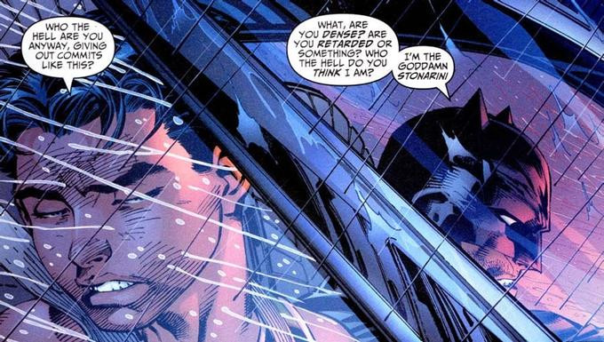

<h1 align=center>Hello There! I'm Samuele Tonarini</h1>

	

---

### About Me

I’m a driven and pragmatic developer focused on building scalable, efficient systems. With experience across both front-end and back-end development, I specialize in delivering solutions that are intuitive, reliable, and maintainable.

I’m always exploring new technologies and approaches, whether it's optimizing backend performance, improving user experiences, or experimenting with IoT and automation. My passion lies in solving problems with thoughtful, innovative solutions that make a real impact.

---

### Highlights

A few things I’ve worked on:  
- **[WeSea Boats](https://weseaboats.com/en):** Lead developer for WeSea Boats, a seasonal boat renting company.  
- **[SRN-MI](https://srn.mi.it/):** Built both internal tools and a SaaS for diesel injectors test benches.  
- **[Dominium](https://github.com/stonarini/dominium):** Multiplayer card videogame written in C++ with custom game engine.  

Feel free to explore my repositories for more.

---

### Writing

I occasionally write about technology, finance, and my experiments.  
You can find all my articles on:

	

---

### Let’s Connect

- **Email:** samueletonarini@gmail.com  
- **LinkedIn:** [Samuele Tonarini](https://www.linkedin.com/in/samueletonarini/)

I’m always happy to connect, collaborate, or chat about new ideas. Feel free to reach out!

---

